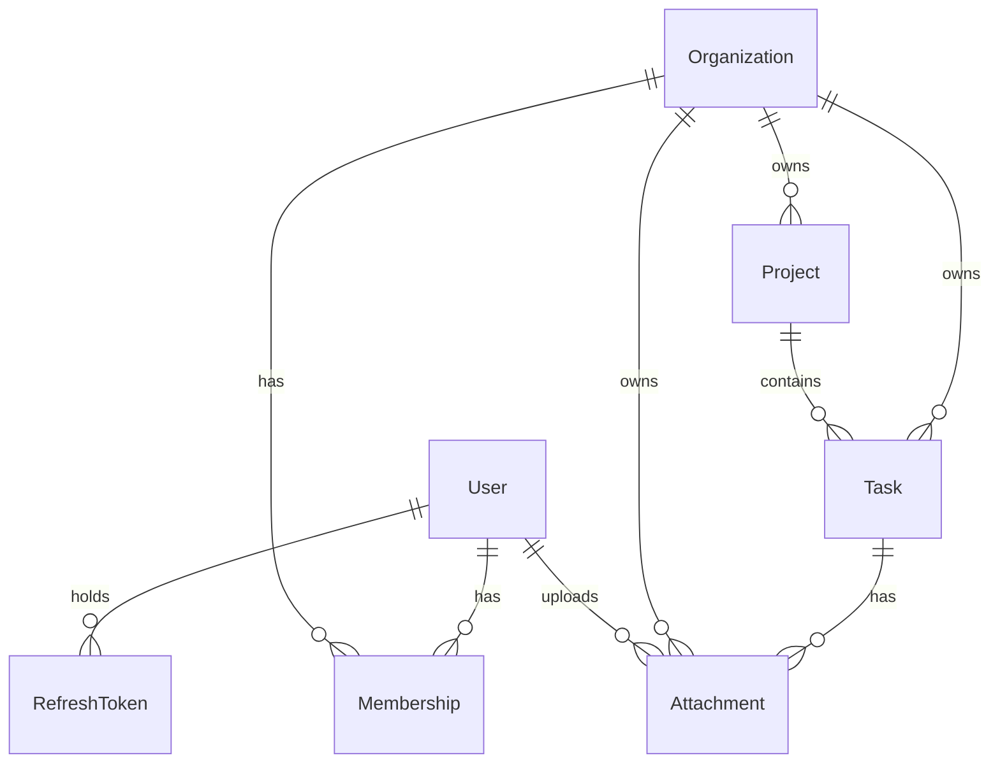

# Architecture

What the system is. The [ADRs](adr/) say why it became that, and are linked
from the sections they explain.

## Shape

Four layers, in one direction:

```
router → controller → service → Prisma
```

A **router** declares paths and attaches middleware. A **controller** unwraps
the request, calls one service method and shapes the response. A **service**
holds the business logic. Prisma is called from services directly, with no
repository layer in between.

`req` and `res` never leave the controller. Services take plain arguments,
return plain data, and throw `AppError` subclasses — which is what lets the
same service be called from a test, a script, or the WebSocket layer planned
for later ([ADR-1](adr/0001-use-express-5-instead-of-nestjs.md)).

Code is grouped by feature rather than by technical role
([ADR-4](adr/0004-feature-based-folder-structure.md)). A module owns its
routes, controller, service, schema, OpenAPI paths and tests:

```
src/
  app.ts                  composition root: builds the app, never listens
  server.ts               owns the API process: listen, SIGTERM, graceful shutdown
  worker.ts               owns the worker process: consumes the notifications queue
  config/                 the only place that reads process.env
  lib/                    db client, error classes, token signing, pagination,
                          Redis connection, Redis-backed cache, S3 object store,
                          email sender
  middleware/             validate, requireUser, requireAuth, requireOrgRole,
                          notFound, errorHandler
  openapi/                shared components, the document, /openapi.json
  jobs/                   the notifications queue and its worker
  modules/
    auth/                 register, login, refresh, logout
    organizations/        create, list
    projects/             list, read, create, delete
    tasks/                list, read, create, assign, change status, stats
    attachments/          presign an upload, confirm it, list a task's attachments
    health/               liveness and readiness
  test/support.ts         one app and one database client, shared by the suite
```

Dependencies are passed as arguments to factory functions and wired in one
place, `createApp()`. There is no DI container and no module-level singleton to
substitute in tests
([ADR-3](adr/0003-explicit-factory-wiring-no-di-container.md)). `createApp()`
never calls `listen()`: the process belongs to `server.ts`, so the test suite
drives the app in memory and shutdown logic lives in exactly one place.

Configuration is parsed through Zod at boot and fails immediately if anything
required is missing, rather than at the first request that needs it.

## The model



An **organization** is the tenant. A **user** exists independently of any
organization and reaches data only through a **membership**, which carries the
role. A **project** belongs to one organization; a **task** belongs to one
project.

Two consequences of that shape are load-bearing.

**Roles are per organization, not per user.** The same person can own one
organization and be a plain member of another. `Membership` is unique on
`(userId, organizationId)`, so one membership per user per organization is a
database guarantee rather than a convention.

**A task stores `organizationId` as well as `projectId`**, so every tenant
filter reads identically on every model instead of joining through the project.
The two cannot disagree: the task's foreign key references the pair
`(id, organizationId)` on `Project`, and Postgres rejects a task whose
organization differs from its project's
([ADR-10](adr/0010-tasks-carry-organization-and-project.md)). Deletes cascade
down the chain — removing an organization removes its projects, and removing a
project removes its tasks.

Creating an organization writes three rows in one interactive transaction: the
organization, an `OWNER` membership for the creator, and a default project.
All three or none. An organization written without a membership would be
unreachable, since every read of one goes through a membership row
([ADR-12](adr/0012-create-an-organization-in-one-transaction.md)).

## A request

```
express.json (100kb)
  → requireUser | requireAuth
  → requireOrgRole (on guarded routes)
  → validate (Zod)
  → controller → service → Prisma
  → notFound
  → errorHandler
```

**Identity** comes from a signed access token. **Authorization** comes from the
database on every request
([ADR-11](adr/0011-authenticate-with-jwt-authorize-from-the-database.md)).

`requireAuth` verifies the bearer token, reads the organization the caller
names in `x-org-id`, and trusts it only once a membership row proves they
belong to it. That membership — id, organization and role — becomes
`req.auth`, and every service method takes `organizationId` as its first
argument and filters on it. An unscoped query is meant to be visually obvious
in review, because it is the failure that would leak one tenant's data to
another ([ADR-7](adr/0007-multi-tenant-with-org-scoped-queries.md)).

The organization is not a claim in the token. Keeping it out means removing a
member or changing a role takes effect on the next request rather than
whenever their token expires.

`requireUser` is the same bearer check without the organization, for the two
routes that run before the caller has one: creating an organization, and
listing the ones they belong to.

`requireOrgRole` compares the caller's role against a minimum. Roles are
ranked — `MEMBER` < `ADMIN` < `OWNER` — rather than mapped to permission sets,
so a route declares the least role that may call it
([ADR-13](adr/0013-ordered-roles-rather-than-a-permission-matrix.md)).
Authorization is always middleware, never a conditional inside a controller or
service.

Failures are refused in two different ways, and the difference is deliberate.
A caller asking for another organization's data gets **404**, identical to the
response for something that does not exist, so ids cannot be used to discover
what is real. A caller whose role is too low gets **403**: they have already
proved membership, so the resource's existence is not a secret from them.

## Validation, types and errors

Zod schemas are the single source of truth
([ADR-5](adr/0005-zod-as-single-source-of-truth.md)). One schema per request
shape drives runtime validation, the TypeScript types via `z.infer`, and the
OpenAPI document. The `validate` middleware parses body, query and params and
stores the result on `req.validated` rather than overwriting `req.query`,
which is a getter in Express 5.

The API documents itself from those same schemas
([ADR-15](adr/0015-generate-the-openapi-document-from-zod.md)). Each module
declares its paths in `<module>.openapi.ts`, `src/openapi/document.ts`
composes them, and the result is served as `/openapi.json` and rendered by
Scalar at `/reference` — both outside `/api/v1` and outside authentication,
since the document describes the shape of the API rather than any tenant's
data. A parameter the reference describes is one the API enforces, because
they are the same object. Response schemas are the exception: what leaves a
service is a Prisma row, not a parsed Zod value, so each response schema is
pinned to its model by two type-level assignments that fail to compile if the
two diverge.

No schema accepts `organizationId`. It is never taken from the client; it
comes from `req.auth` after membership has been verified.

The organization-scoped collections — tasks and projects — are paginated by
offset and return `{ data, meta }` rather than a bare array, so a total has
somewhere to live and the shape survives a later move to cursors
([ADR-14](adr/0014-offset-pagination-behind-a-response-envelope.md)). `page`
and `limit` come from one shared schema with `limit` capped at 100, and `sort`
is a closed enum per module rather than a column name taken from the query
string. Every ordering ends in `id`, because offset pagination over a
non-total ordering can return the same row on two pages.
`GET /organizations` is not paginated: it is bounded by the caller's own
memberships.

Errors are one hierarchy and one handler
([ADR-6](adr/0006-centralized-error-handling.md)). Services throw `AppError`
subclasses — `NotFoundError`, `UnauthorizedError`, `ForbiddenError`,
`ConflictError`, `ValidationError` — each carrying a status and a stable
machine-readable code. A single error middleware, registered last with all
four parameters, turns them into a uniform response body. Anything that is not
an `AppError` is treated as a bug: logged in full, returned as a generic 500.
Express 5 forwards rejected promises to it automatically, so handlers need no
`try`/`catch`.

## Data and persistence

Prisma 7 runs without its Rust query engine, using the `@prisma/adapter-pg`
driver adapter, which is what makes it work under Bun
([ADR-2](adr/0002-bun-as-runtime-and-toolchain.md)). The client is built by a
factory and handed to services, so its lifetime is the composition root's
decision.

Schema changes are migrations, applied with `prisma migrate deploy` in CI so a
schema edit that was never migrated fails there rather than diverging quietly.
`prisma/seed.ts` writes demo data covering all three roles, two organizations
and every task status, and replaces its own rows rather than duplicating them.

## Background jobs

Assigning a task (`POST /tasks/:id/assign`) enqueues a notification job
rather than sending an email inline. `src/worker.ts` is a second entry
point, run separately from the API (`bun run worker`), that consumes the
queue and shares the database client with the API and nothing else.

`tasks.service.ts` depends on `NotificationsQueue`
([src/jobs/notifications.job.ts](../src/jobs/notifications.job.ts)), a
narrow interface rather than a BullMQ `Queue`, so the integration suite can
substitute a fake that records calls instead of running a worker for every
assignment test.
[src/jobs/notifications.worker.test.ts](../src/jobs/notifications.worker.test.ts)
is the exception, against real Redis: one test enqueues a job directly and
confirms a real worker processes it; the other sends a real
`POST /tasks/:id/assign` through a real queue and confirms the same worker
picks it up — proving the endpoint and the worker actually agree, not just
that each independently matches the fake. See
[ADR-16](adr/0016-background-jobs-with-bullmq.md).

The assignee must belong to the task's own organization, enforced the same
way `Task.projectId` is: a composite foreign key referencing `Membership`'s
own `(userId, organizationId)` uniqueness, so Postgres — not just the
service — refuses an assignment to a non-member. See
[ADR-10](adr/0010-tasks-carry-organization-and-project.md).

## Caching

`GET /tasks/stats` — task counts by status and the completion rate they
imply, for one organization — is the first cached read in the codebase.
It's cached in Redis under `stats:tasks:{organizationId}` and read through
a narrow `Cache` interface
([src/lib/cache.ts](../src/lib/cache.ts)), the same shape as
`NotificationsQueue`: `tasks.service.ts` depends on `get`/`set`/`del`, not
an `ioredis` client directly, so the integration suite can substitute an
in-memory fake.

The TTL on each cached entry is a backstop, not the freshness mechanism.
Three writes invalidate it: `create` and `PATCH /tasks/:id/status` change a
task's status distribution directly; deleting a project
(`DELETE /projects/:id`) changes it indirectly, by cascading to every task
in it. All three delete the cached entry for their organization the moment
they commit, so a cache hit is either fresh or absent, never stale. What
the TTL still guards against is a write from outside this codebase
entirely — a script, another service, a migration — which no set of
`cache.del` call sites can ever see. See
[ADR-17](adr/0017-cache-task-stats-with-explicit-invalidation.md), including
its "Known gap" section for the reasoning behind that boundary.

## Attachments

Task attachments upload directly from the client to S3 (MinIO in dev and
test), never through the app server. `POST /tasks/:taskId/attachments/presign`
returns a presigned POST — a short-lived URL and form fields — scoped to one
server-generated key and one content-type from a closed allowlist, with a
size cap enforced by S3 itself via the policy's `content-length-range`
condition. The client uploads to that URL directly; this API never receives
the file's bytes.

A presigned POST has no server-side callback, so
`POST /tasks/:taskId/attachments` is a separate confirm step: given the key
back, it runs `HeadObject` against the bucket and only writes the
`Attachment` row if the object actually exists there, reading `size` and
`contentType` back from the bucket rather than trusting the client's
original claim. `attachments.service.ts` depends on `ObjectStore`
([src/lib/s3.ts](../src/lib/s3.ts)), the same narrow-interface shape as
`Cache` and `NotificationsQueue`, so the integration suite substitutes an
in-memory fake and `lib/s3.test.ts` is the deliberate real-bucket exception,
proving the presigned policy is actually enforced by performing a real
upload against MinIO. See
[ADR-18](adr/0018-presigned-post-uploads-with-a-confirm-step.md).

## Rate limiting

Two layers, not one. A loose, IP-keyed limiter sits in front of the whole
API (`app.use`, before the JSON body parser) and catches anonymous floods
before they reach authentication or the database — it does not try to
identify the caller, since an unauthenticated request may carry no
credentials to identify them by. A second, tighter layer sits on specific
endpoints where the abuse is precise rather than volumetric: `POST
/auth/login` is keyed by IP and the email being attempted, so a brute-force
run against one account is capped without capping every other person on the
same IP, and only failed attempts count, so a legitimate user is never
penalised for other traffic against the same key. `POST
/tasks/:taskId/attachments/presign` is keyed by the caller's verified user
id rather than IP, since it hands out a real S3 write grant and the caller
is already authenticated by the time it runs.

Both layers reuse the same Redis connection BullMQ and the cache already
use — no new infrastructure — through a `RedisStore` from `rate-limit-redis`
so counts are correct across every replica once there is more than one
([lib/rate-limit.ts](../src/lib/rate-limit.ts)). The test suite omits the
Redis connection and gets express-rate-limit's own in-memory store instead,
which is exact for a single-process test run; `lib/rate-limit.test.ts` is
the deliberate real-Redis exception, mirroring `lib/cache.test.ts`. A 429
is thrown as `TooManyRequestsError` so it carries the same JSON shape as
every other error, rather than express-rate-limit's own default response.
See [ADR-20](adr/0020-rate-limiting-by-identity-where-available-ip-otherwise.md).

## Health checks

`GET /health` reports liveness only — the process is running and
answering requests, nothing more. It never touches Postgres or Redis, so a
dependency outage can't make an orchestrator kill a container that would
otherwise recover once the dependency does. `GET /health/ready` is what
actually reaches both, concurrently, and reports per-dependency status
rather than a bare pass/fail. Neither route is documented in the OpenAPI
spec, the same treatment `/openapi.json` itself gets: they describe
infrastructure, not API surface.

## Logging

`pino` writes one JSON line per request (method, path, status, response
time), plus whatever a controller or service logs explicitly, all to
stdout — the shape a container runtime forwards to a log aggregator with no
further application code (CloudWatch, once Week 4 points the ECS task
definition at it).

A request gets an id — reused from an incoming `x-request-id` header if the
caller sent one, generated otherwise — and that id is opened as the current
`AsyncLocalStorage` context for the rest of the request
(`lib/request-context.ts`). Any code running inside that request calls
`getLogger()` to get a logger already tagged with it, without the id being
threaded through every function argument down to the service layer. This is
why it isn't in `Deps` alongside the database or the cache: nothing about it
is worth a test faking or asserting against, unlike the dependencies ADR-3
actually argues for injecting — see
[ADR-19](adr/0019-request-logging-via-asynclocalstorage-not-injection.md).

## Testing

Integration tests run against a real PostgreSQL database, not mocks
([ADR-9](adr/0009-integration-tests-against-a-real-database.md)), on `bun test`
([ADR-8](adr/0008-bun-test-as-test-runner.md)). They drive the app in process
through Supertest against the same `createApp()` the server uses, so what is
tested is the real composition rather than a rearrangement of it. A separate
`kanso_test` database exists because every test clears the tables before it
runs.

The cases that matter most are the ones a mocked client could not check: that
Postgres refuses a task whose organization disagrees with its project, that a
failed transaction leaves no organization behind, and that a rejected request
changed nothing — a 403 test asserts the row still exists, since a guard that
ran after the handler would return the same status over a deleted row.

## Packaging

A three-stage `Dockerfile` builds one image, used for both processes: the
API by default (`CMD ["bun", "src/server.ts"]`) and the worker as the same
image with its command overridden at deploy time (`bun src/worker.ts`).
The stages exist to keep the Prisma CLI — a devDependency, needed only to
generate the client — out of the image that actually runs: `deps` installs
everything, `build` generates the client on top of it, and `runtime`
starts fresh with production-only dependencies plus just the generated
client and `src/` copied over. The image declares its own `HEALTHCHECK`
against `GET /health`, liveness only, for the same reason the endpoint
itself is liveness-only — a dependency outage should not read as the
container needing to be killed.

CI builds this image on every push, gated on the test suite passing first,
starts it against real Postgres, Redis and MinIO, and waits for it to
report healthy before checking `/health/ready` directly — proving the
image is runnable, not just that it builds. Nothing is pushed to a
registry yet; that, and actually deploying from a pulled image, is Week 4.
See [ADR-21](adr/0021-multi-stage-dockerfile-one-image-both-processes.md).

## Not here yet

Nothing is deployed. There is no
concurrency control on updates: two clients writing the same task is
last-write-wins, and optimistic locking is the intended fix. Nothing
prevents the last `OWNER` of an organization leaving it. An attachment
abandoned between presign and confirm — uploaded but never confirmed, or
confirmed key never uploaded to — has no cleanup; see
[ADR-18](adr/0018-presigned-post-uploads-with-a-confirm-step.md)'s
Consequences. `req.ip` is trusted as-is: nothing sets Express's `trust
proxy`, which is correct with no proxy in front today but wrong once Week 4
puts an ALB in front of ECS — the IP-keyed limiters would see the ALB's
address for every caller instead of the real one, unless `trust proxy` is
configured for exactly one hop when that lands. See
[ADR-20](adr/0020-rate-limiting-by-identity-where-available-ip-otherwise.md).
