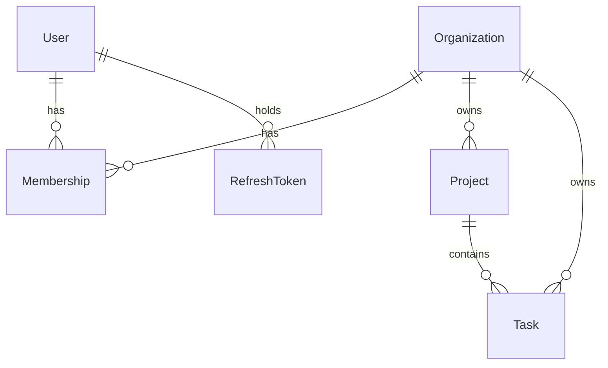

# Architecture

What the system is. The [ADRs](adr/) say why it became that, and are linked
from the sections they explain.

## Shape

Four layers, in one direction:

```
router → controller → service → Prisma
```

A **router** declares paths and attaches middleware. A **controller** unwraps
the request, calls one service method and shapes the response. A **service**
holds the business logic. Prisma is called from services directly, with no
repository layer in between.

`req` and `res` never leave the controller. Services take plain arguments,
return plain data, and throw `AppError` subclasses — which is what lets the
same service be called from a test, a script, or the WebSocket layer planned
for later ([ADR-1](adr/0001-use-express-5-instead-of-nestjs.md)).

Code is grouped by feature rather than by technical role
([ADR-4](adr/0004-feature-based-folder-structure.md)). A module owns its
routes, controller, service, schema and tests:

```
src/
  app.ts                  composition root: builds the app, never listens
  server.ts               owns the process: listen, SIGTERM, graceful shutdown
  config/                 the only place that reads process.env
  lib/                    db client, error classes, token signing, pagination
  middleware/             validate, requireUser, requireAuth, requireOrgRole,
                          notFound, errorHandler
  modules/
    auth/                 register, login, refresh, logout
    organizations/        create, list
    projects/             list, read, create, delete
    tasks/                list, read, create
  test/support.ts         one app and one database client, shared by the suite
```

Dependencies are passed as arguments to factory functions and wired in one
place, `createApp()`. There is no DI container and no module-level singleton to
substitute in tests
([ADR-3](adr/0003-explicit-factory-wiring-no-di-container.md)). `createApp()`
never calls `listen()`: the process belongs to `server.ts`, so the test suite
drives the app in memory and shutdown logic lives in exactly one place.

Configuration is parsed through Zod at boot and fails immediately if anything
required is missing, rather than at the first request that needs it.

## The model



An **organization** is the tenant. A **user** exists independently of any
organization and reaches data only through a **membership**, which carries the
role. A **project** belongs to one organization; a **task** belongs to one
project.

Two consequences of that shape are load-bearing.

**Roles are per organization, not per user.** The same person can own one
organization and be a plain member of another. `Membership` is unique on
`(userId, organizationId)`, so one membership per user per organization is a
database guarantee rather than a convention.

**A task stores `organizationId` as well as `projectId`**, so every tenant
filter reads identically on every model instead of joining through the project.
The two cannot disagree: the task's foreign key references the pair
`(id, organizationId)` on `Project`, and Postgres rejects a task whose
organization differs from its project's
([ADR-10](adr/0010-tasks-carry-organization-and-project.md)). Deletes cascade
down the chain — removing an organization removes its projects, and removing a
project removes its tasks.

Creating an organization writes three rows in one interactive transaction: the
organization, an `OWNER` membership for the creator, and a default project.
All three or none. An organization written without a membership would be
unreachable, since every read of one goes through a membership row
([ADR-12](adr/0012-create-an-organization-in-one-transaction.md)).

## A request

```
express.json (100kb)
  → requireUser | requireAuth
  → requireOrgRole (on guarded routes)
  → validate (Zod)
  → controller → service → Prisma
  → notFound
  → errorHandler
```

**Identity** comes from a signed access token. **Authorization** comes from the
database on every request
([ADR-11](adr/0011-authenticate-with-jwt-authorize-from-the-database.md)).

`requireAuth` verifies the bearer token, reads the organization the caller
names in `x-org-id`, and trusts it only once a membership row proves they
belong to it. That membership — id, organization and role — becomes
`req.auth`, and every service method takes `organizationId` as its first
argument and filters on it. An unscoped query is meant to be visually obvious
in review, because it is the failure that would leak one tenant's data to
another ([ADR-7](adr/0007-multi-tenant-with-org-scoped-queries.md)).

The organization is not a claim in the token. Keeping it out means removing a
member or changing a role takes effect on the next request rather than
whenever their token expires.

`requireUser` is the same bearer check without the organization, for the two
routes that run before the caller has one: creating an organization, and
listing the ones they belong to.

`requireOrgRole` compares the caller's role against a minimum. Roles are
ranked — `MEMBER` < `ADMIN` < `OWNER` — rather than mapped to permission sets,
so a route declares the least role that may call it
([ADR-13](adr/0013-ordered-roles-rather-than-a-permission-matrix.md)).
Authorization is always middleware, never a conditional inside a controller or
service.

Failures are refused in two different ways, and the difference is deliberate.
A caller asking for another organization's data gets **404**, identical to the
response for something that does not exist, so ids cannot be used to discover
what is real. A caller whose role is too low gets **403**: they have already
proved membership, so the resource's existence is not a secret from them.

## Validation, types and errors

Zod schemas are the single source of truth
([ADR-5](adr/0005-zod-as-single-source-of-truth.md)). One schema per request
shape drives runtime validation, the TypeScript types via `z.infer`, and the
OpenAPI spec. The `validate` middleware parses body, query and params and
stores the result on `req.validated` rather than overwriting `req.query`,
which is a getter in Express 5.

No schema accepts `organizationId`. It is never taken from the client; it
comes from `req.auth` after membership has been verified.

The organization-scoped collections — tasks and projects — are paginated by
offset and return `{ data, meta }` rather than a bare array, so a total has
somewhere to live and the shape survives a later move to cursors
([ADR-14](adr/0014-offset-pagination-behind-a-response-envelope.md)). `page`
and `limit` come from one shared schema with `limit` capped at 100, and `sort`
is a closed enum per module rather than a column name taken from the query
string. Every ordering ends in `id`, because offset pagination over a
non-total ordering can return the same row on two pages.
`GET /organizations` is not paginated: it is bounded by the caller's own
memberships.

Errors are one hierarchy and one handler
([ADR-6](adr/0006-centralized-error-handling.md)). Services throw `AppError`
subclasses — `NotFoundError`, `UnauthorizedError`, `ForbiddenError`,
`ConflictError`, `ValidationError` — each carrying a status and a stable
machine-readable code. A single error middleware, registered last with all
four parameters, turns them into a uniform response body. Anything that is not
an `AppError` is treated as a bug: logged in full, returned as a generic 500.
Express 5 forwards rejected promises to it automatically, so handlers need no
`try`/`catch`.

## Data and persistence

Prisma 7 runs without its Rust query engine, using the `@prisma/adapter-pg`
driver adapter, which is what makes it work under Bun
([ADR-2](adr/0002-bun-as-runtime-and-toolchain.md)). The client is built by a
factory and handed to services, so its lifetime is the composition root's
decision.

Schema changes are migrations, applied with `prisma migrate deploy` in CI so a
schema edit that was never migrated fails there rather than diverging quietly.
`prisma/seed.ts` writes demo data covering all three roles, two organizations
and every task status, and replaces its own rows rather than duplicating them.

## Testing

Integration tests run against a real PostgreSQL database, not mocks
([ADR-9](adr/0009-integration-tests-against-a-real-database.md)), on `bun test`
([ADR-8](adr/0008-bun-test-as-test-runner.md)). They drive the app in process
through Supertest against the same `createApp()` the server uses, so what is
tested is the real composition rather than a rearrangement of it. A separate
`kanso_test` database exists because every test clears the tables before it
runs.

The cases that matter most are the ones a mocked client could not check: that
Postgres refuses a task whose organization disagrees with its project, that a
failed transaction leaves no organization behind, and that a rejected request
changed nothing — a 403 test asserts the row still exists, since a guard that
ran after the handler would return the same status over a deleted row.

## Not here yet

No caching, background jobs, structured logging, or rate limiting.
No file uploads. Nothing is deployed. There is no concurrency control on
updates: two clients writing the same task is last-write-wins, and optimistic
locking is the intended fix. Nothing prevents the last `OWNER` of an
organization leaving it.
